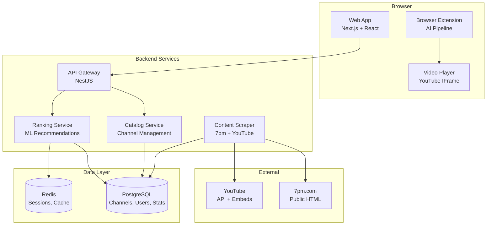
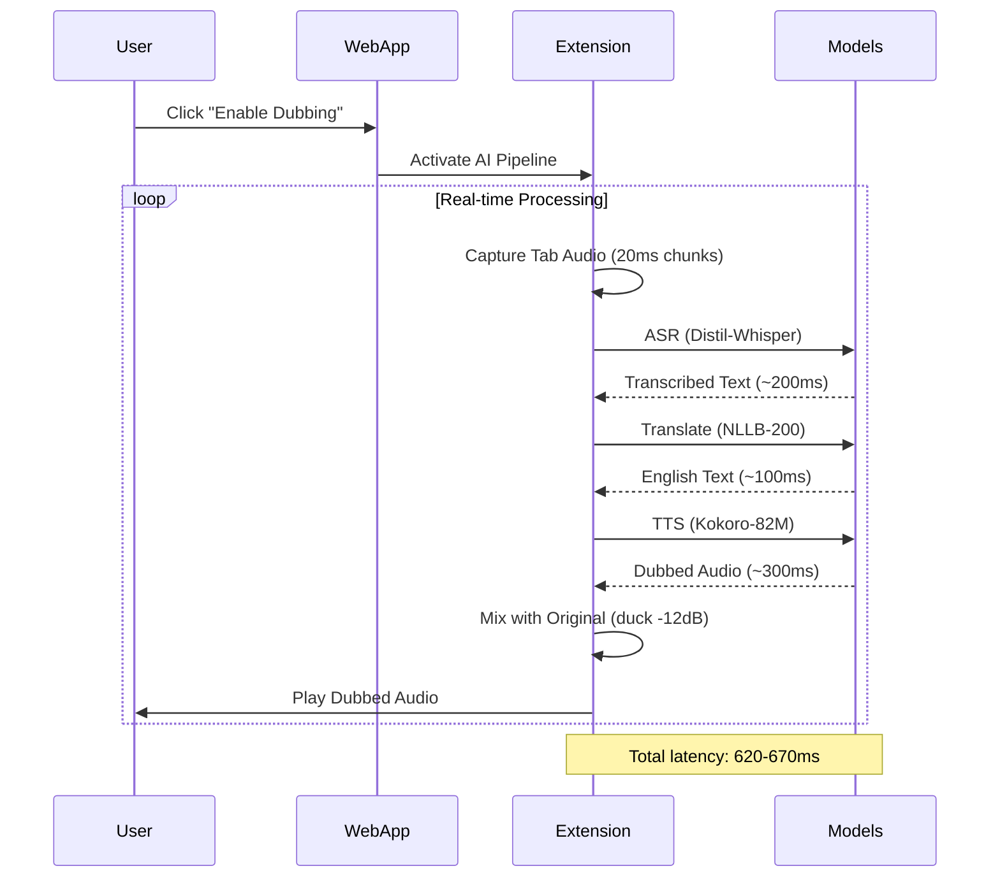

# liveworldtv — System Design Doc

## Context Recap

**Proposal Link**: [liveworldtv-proposal.md](./liveworldtv-proposal.md)

**Phase 1 Key Decisions**:
- **Architecture**: Browser extension + full backend with local AI pipeline  
- **AI Stack**: Distil-Whisper + NLLB-200 + Kokoro-82M (all client-side)
- **Latency Target**: <1 second dubbing (revolutionary improvement)
- **Content Source**: 7pm.com scraping + YouTube Search API fallback
- **UX Strategy**: Captions-first with premium dubbing enhancement

## Architecture Overview

### High-Level Components



### AI Pipeline Data Flow (Browser Extension)



## Interfaces

### API Contracts (OpenAPI 3.0)

#### Catalog Service
```yaml
/v1/channels:
  get:
    parameters:
      - name: country
        schema: { type: string, pattern: "^[A-Z]{2}$" }
      - name: topic  
        schema: { type: string, enum: ["NEWS", "SPORTS", "MUSIC_DJS"] }
      - name: limit
        schema: { type: integer, minimum: 1, maximum: 50, default: 20 }
    responses:
      200:
        content:
          application/json:
            schema:
              type: object
              properties:
                channels:
                  type: array
                  items: { $ref: "#/components/schemas/Channel" }
                pagination: { $ref: "#/components/schemas/Pagination" }
```

#### Ranking Service  
```yaml
/v1/ranking/home:
  get:
    parameters:
      - name: country
        required: true
        schema: { type: string, pattern: "^[A-Z]{2}$" }
      - name: user_id
        schema: { type: string, format: uuid }
    responses:
      200:
        content:
          application/json:
            schema:
              type: object
              properties:
                rails:
                  type: object
                  properties:
                    NEWS: { type: array, items: { $ref: "#/components/schemas/RankedChannel" } }
                    SPORTS: { type: array, items: { $ref: "#/components/schemas/RankedChannel" } }
                    MUSIC_DJS: { type: array, items: { $ref: "#/components/schemas/RankedChannel" } }
                autoplay_selection:
                  $ref: "#/components/schemas/AutoplayChoice"
```

### Event Schemas (Analytics)
```typescript
interface PlayEvent {
  user_id: string
  channel_id: string
  timestamp: number
  event_type: 'play_start' | 'dub_enabled' | 'dub_disabled' | 'seek' | 'stop'
  metadata: {
    dubbing_latency_ms?: number
    audio_quality_score?: number
    user_agent: string
    extension_version?: string
  }
}
```

## Data Model

### Database Schema (PostgreSQL)

```sql
-- Channels and content catalog
CREATE TABLE channels (
  id UUID PRIMARY KEY DEFAULT gen_random_uuid(),
  name VARCHAR(255) NOT NULL,
  country CHAR(2) NOT NULL,
  topic channel_topic NOT NULL,
  source_type channel_source NOT NULL,
  source_url TEXT NOT NULL,
  owner VARCHAR(255),
  first_seen TIMESTAMPTZ NOT NULL DEFAULT NOW(),
  last_seen TIMESTAMPTZ NOT NULL DEFAULT NOW(),
  active BOOLEAN NOT NULL DEFAULT true,
  metadata JSONB DEFAULT '{}',
  
  CONSTRAINT channels_country_check CHECK (country ~ '^[A-Z]{2}$'),
  INDEX idx_channels_country_topic (country, topic, last_seen DESC),
  INDEX idx_channels_active_last_seen (active, last_seen DESC) WHERE active = true
);

CREATE TYPE channel_topic AS ENUM ('NEWS', 'SPORTS', 'MUSIC_DJS');
CREATE TYPE channel_source AS ENUM ('YOUTUBE_EMBED', 'LICENSED');

-- Live stream status tracking
CREATE TABLE live_streams (
  id UUID PRIMARY KEY DEFAULT gen_random_uuid(),
  channel_id UUID REFERENCES channels(id) ON DELETE CASCADE,
  status stream_status NOT NULL DEFAULT 'UNKNOWN',
  started_at TIMESTAMPTZ,
  delay_seconds INTEGER DEFAULT 30,
  dvr_window_sec INTEGER DEFAULT 900, -- 15 min
  last_checked TIMESTAMPTZ NOT NULL DEFAULT NOW(),
  
  UNIQUE (channel_id),
  INDEX idx_live_streams_status (status, last_checked)
);

CREATE TYPE stream_status AS ENUM ('LIVE', 'OFF', 'UNKNOWN');

-- Ranking and recommendation data
CREATE TABLE ranking_stats (
  channel_id UUID REFERENCES channels(id) ON DELETE CASCADE,
  activation_ctr DECIMAL(5,4) DEFAULT 0.0, -- Enable-dub CTR
  ttfmp_ms INTEGER, -- Time to first meaningful phrase
  mos_proxy DECIMAL(3,2), -- Mean opinion score proxy
  speech_ratio DECIMAL(3,2), -- Percentage of content that's speech
  wer_proxy DECIMAL(3,2), -- Word error rate proxy for ASR quality
  sample_size INTEGER DEFAULT 0,
  last_updated TIMESTAMPTZ NOT NULL DEFAULT NOW(),
  
  PRIMARY KEY (channel_id),
  INDEX idx_ranking_stats_updated (last_updated DESC)
);

-- Anonymous user tracking (GDPR compliant)
CREATE TABLE user_sessions (
  session_id UUID PRIMARY KEY DEFAULT gen_random_uuid(),
  preferences JSONB DEFAULT '{"country": null, "topic": null}',
  recent_autoplays UUID[] DEFAULT '{}', -- Last 24h autoplay channel IDs
  created_at TIMESTAMPTZ NOT NULL DEFAULT NOW(),
  expires_at TIMESTAMPTZ NOT NULL DEFAULT NOW() + INTERVAL '7 days',
  
  INDEX idx_user_sessions_expires (expires_at)
);

-- Analytics events (retention: 90 days)
CREATE TABLE play_events (
  id UUID PRIMARY KEY DEFAULT gen_random_uuid(),
  session_id UUID REFERENCES user_sessions(session_id) ON DELETE SET NULL,
  channel_id UUID REFERENCES channels(id) ON DELETE SET NULL,
  event_type event_type NOT NULL,
  event_timestamp TIMESTAMPTZ NOT NULL DEFAULT NOW(),
  metadata JSONB DEFAULT '{}',
  
  INDEX idx_play_events_timestamp (event_timestamp DESC),
  INDEX idx_play_events_channel_type (channel_id, event_type, event_timestamp)
);

CREATE TYPE event_type AS ENUM (
  'play_start', 'dub_enabled', 'dub_disabled', 'seek', 'stop', 
  'extension_installed', 'model_loaded', 'quality_feedback'
);
```

### Data Ownership & Retention
- **Channels**: Public data, indefinite retention with freshness updates
- **User sessions**: Anonymous, auto-expire after 7 days  
- **Analytics events**: 90-day retention for ranking optimization
- **Rankings**: Derived data, recalculated daily with 1-year history

## Scalability

### Load Estimates (Conservative)
- **Target**: 10K concurrent users by month 6
- **Channel catalog**: ~500 active channels across countries/topics
- **API requests**: ~100K/day (discovery + play events)
- **Database**: <10GB for full dataset
- **CDN**: AI model distribution (660MB per user, one-time)

### Capacity Calculations
```typescript
// Backend capacity (NestJS + PostgreSQL)
const estimatedLoad = {
  concurrent_users: 10000,
  api_requests_per_second: 50, // Very low due to local AI processing
  database_connections: 20, // Connection pooling
  redis_memory: "2GB", // Session cache + ranking cache
  cdn_bandwidth: "100GB/day" // AI model downloads for new users
}
```

### Caching Strategy
1. **CDN**: AI models cached at edge (660MB per user)
2. **Redis**: Channel rankings (1h TTL), user sessions (7d TTL)
3. **Database**: Read replicas for ranking queries
4. **Browser**: AI models in IndexedDB (permanent cache)

## Reliability

### Failure Modes & Mitigation

#### **Extension AI Pipeline Failures**
```typescript
// Graceful degradation strategy
const fallbackChain = [
  "WebGPU + Full AI Stack", // Best experience: <1s dubbing
  "WebAssembly + Quantized Models", // Medium: 2-3s dubbing  
  "Cloud API + Caching", // Backup: 3-6s dubbing
  "Captions Only" // Fallback: No dubbing, captions only
]
```

#### **Backend Service Failures**
- **Catalog API down**: Serve cached channel list, degrade to static content
- **Ranking service down**: Fallback to popularity-based sorting
- **Database unavailable**: Serve from Redis cache, graceful degradation
- **7pm scraping blocked**: Automatic YouTube Search API activation

### Retry & Idempotency
- **API calls**: Exponential backoff with 3 retries, circuit breaker pattern
- **AI model loading**: Progressive download with resume capability
- **Analytics events**: Best-effort delivery with client-side queuing

## Security & Privacy

### Threat Model (STRIDE Analysis)

#### **Spoofing**: 
- **Risk**: Fake analytics events, ranking manipulation
- **Mitigation**: Request signing, rate limiting, session validation

#### **Tampering**:
- **Risk**: Modified AI models, malicious browser extension
- **Mitigation**: Model integrity checks (SHA256), extension signed distribution

#### **Repudiation**:
- **Risk**: Users denying usage for billing/analytics  
- **Mitigation**: Pseudonymous analytics, no PII collection

#### **Information Disclosure**:
- **Risk**: User viewing patterns, content preferences leaked
- **Mitigation**: Local processing, encrypted sessions, data minimization

#### **Denial of Service**:
- **Risk**: API abuse, resource exhaustion from AI model downloads
- **Mitigation**: Rate limiting, CDN distribution, graceful degradation

#### **Elevation of Privilege**:
- **Risk**: Extension accessing more than intended browser APIs
- **Mitigation**: Minimal permissions, content script isolation

### Data Residency & Privacy
- **AI Processing**: 100% local, no cloud transmission
- **User Data**: Pseudonymous, auto-expiring sessions
- **Analytics**: Aggregated only, no individual tracking
- **GDPR Compliance**: Data minimization, right to deletion, consent management

## Observability

### Metrics (OpenTelemetry)

#### **Business Metrics**
```typescript
const businessMetrics = {
  // Activation
  dubbing_enable_ctr: "Counter", // Extension users who enable dubbing
  ttfmp_p50: "Histogram", // Time to first meaningful phrase
  
  // Engagement  
  watch_duration_with_dub: "Histogram", // Retention with dubbing enabled
  channel_discovery_rate: "Counter", // Rails click-through
  
  // Quality
  dubbing_quality_score: "Gauge", // User feedback on dubbing quality
  audio_latency_p95: "Histogram", // End-to-end dubbing latency
}
```

#### **Technical Metrics**
```typescript
const technicalMetrics = {
  // AI Performance
  model_loading_time: "Histogram", // WebGPU model initialization
  inference_latency: "Histogram", // Per-model latency (ASR/MT/TTS)
  webgpu_availability: "Gauge", // Browser WebGPU support rate
  
  // Infrastructure
  api_request_duration: "Histogram",
  database_query_duration: "Histogram", 
  ranking_calculation_time: "Histogram",
  scraping_success_rate: "Counter",
}
```

### SLOs & Alert Policies
```yaml
slos:
  dubbing_latency:
    target: "95% of requests < 1000ms end-to-end"
    error_budget: "5% over 28 days"
    
  api_availability:  
    target: "99.9% availability"
    error_budget: "8.6 hours per month"
    
  model_loading:
    target: "90% of extensions load models < 30s"
    error_budget: "10% failure rate"

alerts:
  critical:
    - "Extension crash rate > 5%"
    - "API error rate > 1%"
    - "Database connection failures"
  
  warning:
    - "Dubbing latency p95 > 1500ms"
    - "Model download failures > 10%"
    - "Ranking staleness > 2h"
```

## Rollout Strategy

### Feature Flags
```typescript
const featureFlags = {
  // Core functionality
  enable_dubbing: boolean, // Master switch for AI dubbing
  enable_webgpu: boolean, // WebGPU acceleration toggle
  enable_local_models: boolean, // Local vs cloud AI fallback
  
  // Content & discovery
  enable_ranking_v2: boolean, // New ranking algorithm
  enable_7pm_scraping: boolean, // Primary content source
  enable_youtube_fallback: boolean, // Backup content source
  
  // Performance & quality
  enable_model_preloading: boolean, // Preload AI models on install
  enable_quality_feedback: boolean, // User quality rating system
  dubbing_quality_threshold: number, // Auto-disable if quality poor
}
```

### Canary Rollout Plan
1. **Week 1**: Internal testing (extension + webapp)
2. **Week 2**: 1% of traffic, extension users only
3. **Week 3**: 5% of traffic, monitor quality metrics
4. **Week 4**: 25% of traffic, full feature validation  
5. **Week 5**: 100% rollout if SLOs maintained

### Migration & Backfill Strategy
- **Database migrations**: Zero-downtime with dual-write pattern
- **Model updates**: Versioned models with backward compatibility
- **Extension updates**: Auto-update with rollback capability
- **API versioning**: v1 → v2 with deprecation timeline

## Test Strategy

### Unit Tests
- **Ranking algorithms**: Thompson sampling, diversity constraints
- **Content ingestion**: 7pm parser, YouTube API integration
- **Feature flags**: Configuration validation, rollout percentages
- **Data models**: Schema validation, business rules

### Contract Tests  
```typescript
// API contract validation
describe('/v1/channels', () => {
  it('returns valid channel schema', async () => {
    const response = await request(app)
      .get('/v1/channels?country=US&topic=NEWS')
    
    expect(response.body).toMatchSchema(channelListSchema)
    expect(response.body.channels).toHaveLength(20) // Default limit
  })
})
```

### Integration Tests
- **End-to-end dubbing**: Extension activation → model loading → audio output
- **Content discovery**: Country/topic selection → channel loading → playback
- **Fallback scenarios**: WebGPU unavailable → WebAssembly fallback

### Performance Tests
```typescript
// Load testing scenarios
const loadTests = {
  concurrent_users: 1000,
  ramp_up: "5 minutes",
  duration: "30 minutes",
  
  scenarios: [
    "Browse channels (no extension)",
    "Enable dubbing (extension required)", 
    "Switch countries rapidly",
    "Model download surge (new users)"
  ]
}
```

## Runbook

### On-call Procedures

#### **P0 Incidents (Immediate Response)**
- Extension crash rate >5% → Disable feature flag, investigate model loading
- API availability <95% → Check database connectivity, scale backend
- Dubbing latency >5s → Investigate AI model performance, check WebGPU

#### **P1 Incidents (Within 2 hours)**  
- Content scraping failures → Switch to YouTube API fallback
- Model download failures >15% → CDN investigation, model serving
- Ranking staleness >4h → Restart ranking service, check data pipeline

### Dashboards
1. **User Experience**: Dubbing activation, latency p95, quality scores
2. **Technical Health**: API latency, database performance, model loading
3. **Content Pipeline**: Scraping success, channel freshness, ranking accuracy
4. **Extension Metrics**: Install rate, model download success, crash rate

### Debug Procedures
```typescript
// Extension debugging
const debugExtension = {
  check_webgpu: "chrome://gpu in browser",
  model_status: "chrome-extension://[id]/popup.html",
  console_logs: "chrome://extensions → Developer mode → background page",
  performance: "chrome://performance → Extension impact"
}
```