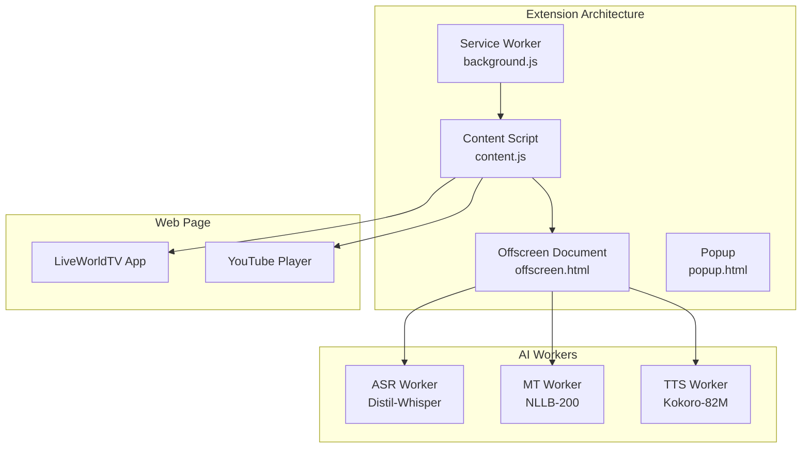

# Browser Extension Architecture Specification

## Overview

The LiveWorldTV browser extension implements the local AI dubbing pipeline using Chrome Manifest V3 architecture. This specification defines the complete implementation approach for real-time audio processing and AI model integration.

## Extension Components Architecture

### Core Components (Manifest V3)



## Component Specifications

### 1. Service Worker (background.js)

**Purpose**: Coordinates extension lifecycle, model management, tab capture
**Runtime**: Persistent during active dubbing sessions

```typescript
// background/background.ts
class ExtensionServiceWorker {
  private modelManager: ModelManager
  private tabManager: TabManager
  private analyticsBuffer: AnalyticsEvent[]
  
  constructor() {
    this.modelManager = new ModelManager()
    this.tabManager = new TabManager()
    this.analyticsBuffer = []
    
    this.setupMessageHandlers()
    this.setupTabCapture()
  }
  
  private setupMessageHandlers(): void {
    chrome.runtime.onMessage.addListener(
      (message: ExtensionMessage, sender, sendResponse) => {
        switch (message.type) {
          case 'ENABLE_DUBBING':
            this.enableDubbing(message.tabId)
            break
          case 'DISABLE_DUBBING':
            this.disableDubbing(message.tabId)
            break
          case 'GET_MODEL_STATUS':
            sendResponse(this.modelManager.getStatus())
            break
        }
      }
    )
  }
  
  private async enableDubbing(tabId: number): Promise<void> {
    // 1. Verify models are loaded
    await this.modelManager.ensureModelsReady()
    
    // 2. Request tab capture permission
    const stream = await chrome.tabCapture.capture({
      audio: true,
      video: false
    })
    
    // 3. Setup offscreen document for audio processing
    await this.setupOffscreenProcessor(tabId, stream)
    
    // 4. Notify content script
    chrome.tabs.sendMessage(tabId, {
      type: 'DUBBING_ENABLED',
      data: { stream: stream }
    })
  }
}
```

### 2. Model Manager

**Purpose**: Download, cache, and validate AI models
**Storage**: IndexedDB for persistent model caching

```typescript
// background/model-manager.ts
interface ModelSpec {
  name: 'distil-whisper' | 'nllb-200' | 'kokoro-82m'
  url: string
  size: number
  sha256: string
  runtime: 'webgpu' | 'wasm' | 'cpu'
}

class ModelManager {
  private static readonly MODEL_SPECS: ModelSpec[] = [
    {
      name: 'distil-whisper',
      url: 'https://cdn.liveworldtv.com/models/distil-whisper-base.onnx',
      size: 57 * 1024 * 1024, // 57MB
      sha256: 'abc123...', // Model integrity hash
      runtime: 'webgpu'
    },
    {
      name: 'nllb-200',
      url: 'https://cdn.liveworldtv.com/models/nllb-200-distilled-600m.onnx',
      size: 600 * 1024 * 1024, // 600MB
      sha256: 'def456...',
      runtime: 'webgpu'
    },
    {
      name: 'kokoro-82m',
      url: 'https://cdn.liveworldtv.com/models/kokoro-82m.onnx',
      size: 3.2 * 1024 * 1024, // 3.2MB
      sha256: 'ghi789...',
      runtime: 'webgpu'
    }
  ]
  
  async downloadModel(spec: ModelSpec): Promise<void> {
    // Progressive download with resumption
    const response = await fetch(spec.url, {
      headers: this.getResumeHeaders(spec.name)
    })
    
    if (!response.ok) throw new Error(`Download failed: ${response.status}`)
    
    // Stream to IndexedDB with progress tracking
    const reader = response.body?.getReader()
    const chunks: Uint8Array[] = []
    let downloadedBytes = 0
    
    while (true) {
      const { done, value } = await reader!.read()
      if (done) break
      
      chunks.push(value)
      downloadedBytes += value.length
      
      // Report progress
      this.notifyProgress(spec.name, downloadedBytes / spec.size)
    }
    
    // Verify integrity
    const modelData = new Uint8Array(downloadedBytes)
    let offset = 0
    for (const chunk of chunks) {
      modelData.set(chunk, offset)
      offset += chunk.length
    }
    
    const hash = await this.calculateSHA256(modelData)
    if (hash !== spec.sha256) {
      throw new Error('Model integrity check failed')
    }
    
    // Store in IndexedDB
    await this.storeModel(spec.name, modelData)
  }
  
  async ensureModelsReady(): Promise<boolean> {
    const status = await this.getModelStatus()
    
    for (const spec of ModelManager.MODEL_SPECS) {
      if (!status[spec.name].loaded) {
        await this.downloadModel(spec)
      }
    }
    
    return this.allModelsLoaded()
  }
}
```

### 3. Content Script Integration

**Purpose**: Bridge between web app and extension, inject dubbing controls
**Context**: Runs in LiveWorldTV web app pages

```typescript
// content/content.ts
class ContentScriptController {
  private dubbingEnabled = false
  private extensionReady = false
  private messageQueue: WebAppMessage[] = []
  
  constructor() {
    this.injectDubbingControls()
    this.setupWebAppCommunication()
    this.notifyExtensionReady()
  }
  
  private injectDubbingControls(): void {
    // Find YouTube player container
    const playerContainer = document.querySelector('#youtube-player-container')
    if (!playerContainer) return
    
    // Inject dubbing control overlay
    const overlay = this.createDubbingOverlay()
    playerContainer.appendChild(overlay)
    
    // Setup YouTube IFrame API event handlers
    this.setupYouTubePlayerEvents()
  }
  
  private createDubbingOverlay(): HTMLElement {
    const overlay = document.createElement('div')
    overlay.className = 'liveworldtv-dubbing-overlay'
    overlay.innerHTML = `
      <div class="dubbing-controls">
        <button id="enable-dubbing" class="dubbing-button">
          🎧 Enable English Dubbing
        </button>
        <div id="dubbing-status" class="dubbing-status" style="display: none;">
          <span class="status-text">Processing...</span>
          <span class="latency-indicator">~0.8s delay</span>
        </div>
      </div>
    `
    
    // Event handlers
    overlay.querySelector('#enable-dubbing')?.addEventListener('click', () => {
      this.requestDubbingActivation()
    })
    
    return overlay
  }
  
  private async requestDubbingActivation(): Promise<void> {
    try {
      // Request permission from service worker
      const response = await chrome.runtime.sendMessage({
        type: 'ENABLE_DUBBING',
        tabId: await this.getCurrentTabId(),
        timestamp: Date.now()
      })
      
      if (response.success) {
        this.enableDubbingUI()
        this.notifyWebApp({ type: 'DUBBING_STATUS', data: { dubbingEnabled: true } })
      }
    } catch (error) {
      console.error('Dubbing activation failed:', error)
      this.showDubbingError('Failed to start dubbing. Please refresh and try again.')
    }
  }
  
  private setupWebAppCommunication(): void {
    // Listen for messages from web app
    window.addEventListener('message', (event) => {
      if (event.origin !== window.location.origin) return
      
      const message = event.data as WebAppMessage
      switch (message.type) {
        case 'REQUEST_EXTENSION_STATUS':
          this.sendExtensionStatus()
          break
        case 'REQUEST_DUBBING_TOGGLE':
          this.toggleDubbing()
          break
      }
    })
  }
}
```

### 4. Offscreen Document (Audio Processing)

**Purpose**: Handle audio processing in Manifest V3 environment
**Runtime**: Created/destroyed per dubbing session

```typescript
// offscreen/audio-processor.ts
class AudioProcessor {
  private audioContext: AudioContext
  private dubbingPipeline: DubbingPipeline
  private outputStream: MediaStream
  
  constructor() {
    this.audioContext = new AudioContext({ sampleRate: 24000 })
    this.dubbingPipeline = new DubbingPipeline()
  }
  
  async processTabAudio(inputStream: MediaStream): Promise<MediaStream> {
    // Create audio processing nodes
    const source = this.audioContext.createMediaStreamSource(inputStream)
    const processor = this.audioContext.createScriptProcessor(4096, 1, 1)
    const destination = this.audioContext.createMediaStreamDestination()
    
    // Setup dubbing pipeline
    processor.onaudioprocess = async (event) => {
      const inputBuffer = event.inputBuffer.getChannelData(0)
      
      // Process through AI pipeline (if enabled)
      if (this.dubbingPipeline.isEnabled) {
        const dubbedAudio = await this.dubbingPipeline.process(inputBuffer)
        
        // Mix original (ducked) + dubbed audio
        const mixedBuffer = this.mixAudio(inputBuffer, dubbedAudio, -12) // Duck original -12dB
        
        // Output mixed audio
        event.outputBuffer.getChannelData(0).set(mixedBuffer)
      } else {
        // Pass through original audio
        event.outputBuffer.getChannelData(0).set(inputBuffer)
      }
    }
    
    // Connect processing chain
    source.connect(processor)
    processor.connect(destination)
    
    return destination.stream
  }
  
  private mixAudio(original: Float32Array, dubbed: Float32Array, duckDb: number): Float32Array {
    const duckFactor = Math.pow(10, duckDb / 20) // Convert dB to linear
    const output = new Float32Array(original.length)
    
    for (let i = 0; i < original.length; i++) {
      // Duck original audio and mix with dubbed
      output[i] = (original[i] * duckFactor) + dubbed[i]
      
      // Prevent clipping
      if (output[i] > 1) output[i] = 1
      if (output[i] < -1) output[i] = -1
    }
    
    return output
  }
}
```

### 5. AI Pipeline Implementation

**Purpose**: Coordinate ASR → MT → TTS processing chain
**Performance**: Target <1s WebGPU, <3s WebAssembly fallback

```typescript
// workers/dubbing-pipeline.ts
class DubbingPipeline {
  private asrWorker: ASRWorker
  private mtWorker: MTWorker
  private ttsWorker: TTSWorker
  private processingQueue: AudioChunk[] = []
  private isProcessing = false
  
  constructor() {
    this.initializeWorkers()
  }
  
  async process(audioBuffer: Float32Array): Promise<Float32Array> {
    const chunk = new AudioChunk(audioBuffer, Date.now())
    
    // Add to processing queue
    this.processingQueue.push(chunk)
    
    if (!this.isProcessing) {
      this.processQueue()
    }
    
    // Return processed audio (async pipeline)
    return this.getProcessedAudio(chunk.timestamp)
  }
  
  private async processQueue(): Promise<void> {
    this.isProcessing = true
    
    while (this.processingQueue.length > 0) {
      const chunk = this.processingQueue.shift()!
      
      try {
        // 1. Speech Recognition (200-500ms)
        const transcript = await this.asrWorker.transcribe(chunk.audio)
        if (!transcript.trim()) continue // Skip silent audio
        
        // 2. Translation (100-200ms)
        const translated = await this.mtWorker.translate(transcript, 'en')
        
        // 3. Text-to-Speech (300ms)
        const dubbedAudio = await this.ttsWorker.synthesize(translated)
        
        // 4. Store for mixing
        this.storeProcessedAudio(chunk.timestamp, dubbedAudio)
        
        // 5. Report latency
        this.reportLatency(chunk.timestamp, Date.now() - chunk.timestamp)
        
      } catch (error) {
        console.error('Processing failed for chunk:', error)
        this.reportError('PROCESSING_FAILED', error)
      }
    }
    
    this.isProcessing = false
  }
}

// Individual worker specifications
interface ASRWorker {
  model: 'distil-whisper-base'
  runtime: 'webgpu' | 'wasm'
  
  transcribe(audio: Float32Array): Promise<string>
  getLatency(): number
}

interface MTWorker {
  model: 'nllb-200-distilled-600m'
  runtime: 'webgpu' | 'wasm'
  
  translate(text: string, targetLang: string): Promise<string>
  getSupportedLanguages(): string[]
}

interface TTSWorker {
  model: 'kokoro-82m'
  runtime: 'webgpu' | 'wasm'
  voice: KokoroVoice
  
  synthesize(text: string): Promise<Float32Array>
  setVoice(voice: KokoroVoice): void
}
```

### 6. Performance Optimization Specifications

```typescript
// Performance optimization strategies
const PerformanceSpecs = {
  audio_chunking: {
    chunk_size_ms: 1000, // 1 second chunks
    overlap_ms: 200, // 200ms overlap for context
    max_silence_ms: 2000 // Skip processing if silent
  },
  
  model_optimization: {
    webgpu: {
      precision: 'fp16', // Half precision for speed
      batch_size: 1, // Real-time streaming
      memory_limit: '2GB'
    },
    wasm: {
      threads: 4, // Multi-threaded processing
      simd: true, // SIMD optimization
      memory_limit: '1GB'
    }
  },
  
  caching: {
    translation_cache: {
      size: 1000, // Most recent 1000 translations
      ttl_ms: 300000 // 5 minutes
    },
    tts_cache: {
      size: 500, // Most recent 500 synthesized phrases
      ttl_ms: 600000 // 10 minutes
    }
  },
  
  fallback_strategy: {
    webgpu_timeout_ms: 1000, // Fallback to WASM if WebGPU slow
    model_load_timeout_ms: 30000, // 30s model loading timeout
    processing_timeout_ms: 5000 // 5s per chunk timeout
  }
}
```

### 7. Error Handling & Fallbacks

```typescript
// Error handling specifications
class ExtensionErrorHandler {
  private fallbackChain = [
    'webgpu_full_models',
    'wasm_quantized_models', 
    'cloud_api_fallback',
    'captions_only'
  ]
  
  async handleProcessingError(error: ProcessingError): Promise<void> {
    switch (error.type) {
      case 'WEBGPU_UNAVAILABLE':
        await this.fallbackToWasm()
        break
        
      case 'MODEL_LOAD_FAILED':
        await this.retryModelDownload(error.modelName)
        break
        
      case 'INFERENCE_TIMEOUT':
        await this.fallbackToCloudAPI()
        break
        
      case 'AUDIO_CAPTURE_FAILED':
        this.showUserError('Unable to capture audio. Please refresh and try again.')
        break
        
      default:
        await this.fallbackToCaptionsOnly()
    }
  }
  
  private async fallbackToWasm(): Promise<void> {
    // Switch to WebAssembly runtime
    await this.dubbingPipeline.switchRuntime('wasm')
    this.showUserNotification('Using compatibility mode (2-3s latency)')
  }
  
  private async fallbackToCaptionsOnly(): Promise<void> {
    // Disable dubbing, show captions only
    this.dubbingPipeline.disable()
    this.showUserNotification('Dubbing unavailable. Showing captions only.')
  }
}
```

### 8. Extension Permissions & Security

```json
{
  "permissions": [
    "tabCapture",           // Required for YouTube audio capture
    "storage",              // Model caching and user preferences  
    "offscreen"             // Audio processing in Manifest V3
  ],
  "host_permissions": [
    "https://*.liveworldtv.com/*"  // Only our domain for security
  ],
  "content_security_policy": {
    "extension_pages": "script-src 'self' 'wasm-unsafe-eval'; object-src 'self';"
  }
}
```

**Security Constraints**:
- **Minimal permissions**: Only tabCapture for our domain
- **No external network access**: All AI processing local
- **Content script isolation**: Limited to LiveWorldTV pages
- **Model integrity**: SHA256 verification for all downloads
- **User consent**: Explicit permission for audio access

### 9. Extension Testing Strategy

```typescript
// Extension test specifications
interface ExtensionTestSpecs {
  unit_tests: {
    model_manager: [
      'downloads models correctly',
      'verifies SHA256 integrity', 
      'handles network failures',
      'implements progressive download'
    ]
    
    dubbing_pipeline: [
      'processes audio chunks sequentially',
      'maintains latency under target',
      'handles worker failures gracefully',
      'caches repeated translations'
    ]
    
    content_script: [
      'detects YouTube players correctly',
      'injects controls without conflicts',
      'communicates with background script',
      'handles permission errors'
    ]
  }
  
  integration_tests: {
    end_to_end_dubbing: [
      'activates on button click',
      'captures YouTube audio',
      'outputs dubbed audio',
      'reports accurate latency'
    ]
    
    fallback_scenarios: [
      'webgpu_unavailable → wasm_fallback',
      'model_load_failure → retry_logic',
      'audio_capture_failure → user_error'
    ]
  }
  
  performance_tests: {
    load_simulation: [
      'concurrent_dubbing_sessions: 5',
      'model_loading_stress_test',
      'memory_usage_under_500mb',
      'cpu_usage_under_25%'
    ]
  }
}
```

### 10. Extension Distribution

```yaml
# Extension packaging and distribution
packaging:
  build_process:
    - webpack_bundle_optimization
    - model_file_preparation  
    - manifest_validation
    - chrome_web_store_packaging
    
  chrome_web_store:
    category: "Productivity"
    permissions_justification:
      tabCapture: "Required to access YouTube audio for real-time dubbing"
      storage: "Cache AI models locally for performance and privacy"
      offscreen: "Process audio in Manifest V3 compliant way"
    
  auto_updates:
    frequency: "weekly"
    rollout_strategy: "gradual (10% → 50% → 100%)"
    rollback_capability: true
    
  analytics:
    install_tracking: true
    crash_reporting: true
    performance_monitoring: true
    privacy_compliant: true
```

This extension architecture provides the foundation for Phase 4 implementation while addressing all constraints identified in Phase 1-2 verification.